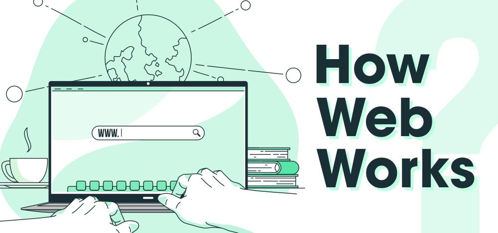
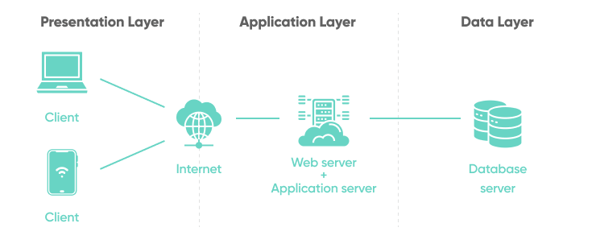
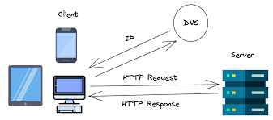
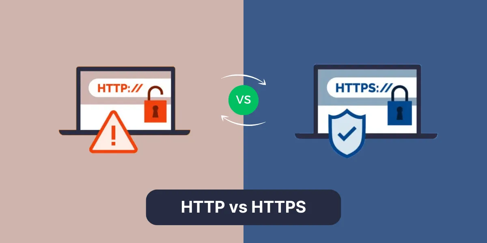
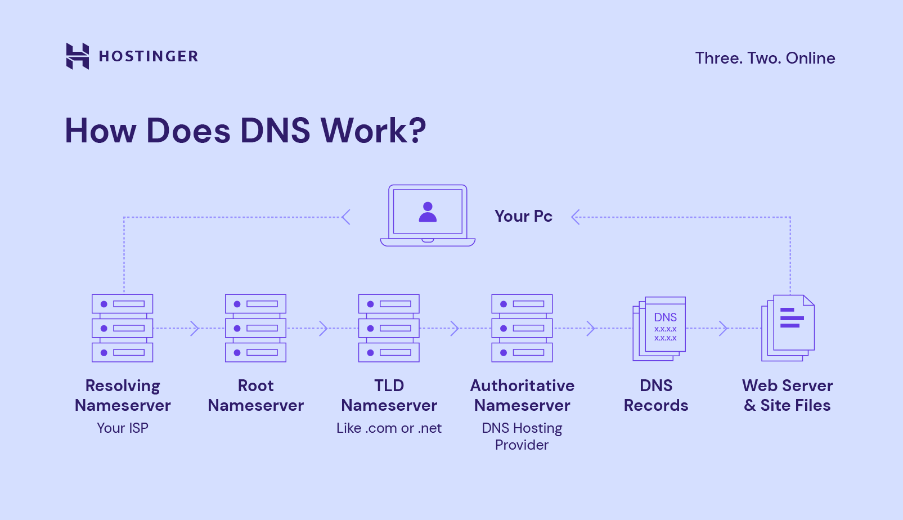
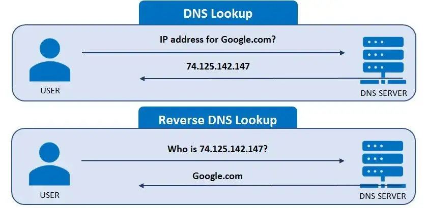

# How the Web Works and Web Protocols: A Journey Through the Internet’s Architecture



> Imagine sending a letter to a friend across the world. You write the letter, address it, and hand it to a postal service. The letter is sorted, sent through a series of postal stations, and eventually arrives at your friend's doorstep. Now, replace the letter with information, the postal service with the internet, and your friend's house with a website — this is, in essence, how the web works. Let’s dive deeper into the intricacies of this process, exploring the architecture of the web, web protocols, and the magic behind popular web services.


## The Architecture of the Web


The World Wide Web (commonly referred to as “the web”) operates on a client-server model, a fundamental architectural design. Think of the client as you, the user, writing and sending the letter, and the server as the recipient receiving and processing it.

1. **The Client:**  
   A client is any device capable of accessing the web — smartphones, laptops, or even smart TVs. When you type a website's address (e.g., www.google.com) into your browser, you’re essentially requesting specific information from a server.
2. **The Server:**  
   Servers are powerful computers that store and manage websites, applications, and data. They “listen” for requests from clients and respond by sending the requested data back. For example, when you search for “cats” on YouTube, a server retrieves cat videos and sends them to your device.
3. **The Internet:**  
   Between the client and server lies the internet — the infrastructure that carries your “letter.” The internet is a massive network of interconnected computers, routers, and cables that ensures your requests reach the right destination and the responses return to you.
4. **Protocols:**  
   Protocols act as the rules of the postal service, dictating how information should be packaged, addressed, sent, and received. Without these rules, communication between clients and servers would be impossible. Let’s unpack these protocols in detail.



---

### Key Web Protocols

.jpg)

Just as the postal system has processes for sorting mail, the web relies on specific protocols to ensure smooth communication. Here are the most essential ones:

1. **HTTP/HTTPS:**  
   HTTP (HyperText Transfer Protocol) is the protocol that governs the communication between your browser (client) and the server hosting a website.

> _Think of HTTP as the postal worker delivering your letter. When you type a URL, your browser sends an HTTP request to the server asking for the webpage.
> HTTPS (HTTP Secure) is the secure version, ensuring the data exchanged is encrypted and protected from prying eyes. It’s like sealing your letter in a tamper-proof envelope._


2. **HTML:**  
HTML (HyperText Markup Language) is the language used to structure the content of web pages. It’s like the paper and ink used to write your letter. HTML organizes elements like text, images, and links to create visually appealing and interactive web pages.  
For example, the HTML code below creates a simple webpage with a title and a heading:
```html
<!DOCTYPE html>
<html>
  <head>
    <title>Welcome</title>
  </head>
  <body>
    <h1>Hello, World!</h1>
  </body>
</html>
```
3. **DNS:**  
DNS (Domain Name System) acts like an address book. While you remember a website’s name (e.g., www.google.com), computers work with numerical IP addresses _(e.g., 142.250.72.78)_. DNS translates the human-friendly name into the corresponding IP address, ensuring your request is routed correctly.



---

### How Popular Services Are Implemented on the Web
The web isn’t just a single-purpose tool; it powers countless services. Here’s a look at how some of them work:
1. **E-commerce (e.g., Amazon):**  
    * _Client Request:_ You browse for a product on Amazon. Your browser sends an HTTP request to Amazon’s server.
    * _Server Processing:_ Amazon’s server retrieves product details, availability, and pricing from its database.
    * _Response:_ The server sends this data back to your browser, where it’s displayed using HTML, CSS (for styling), and JavaScript (for interactivity).
2. **Social Media (e.g., Facebook):**
    * _Data Storage:_ Social media platforms store user data, posts, and images in vast databases.
    * _Real-Time Updates:_ WebSockets (a communication protocol) allow for real-time updates, like instant notifications and message delivery.
    * _Content Delivery:_ Content is often cached and delivered through Content Delivery Networks (CDNs), which ensure faster loading times.

---

#### How the Web Works: Step-by-Step
Here’s a simplified flow of how a typical web interaction occurs:
1. **Typing the URL:** You enter https://github.com in your browser.

2. **DNS Lookup:** Your browser queries the DNS to find the IP address of the webpage you are looking for.  

3. **HTTP Request:** Your browser sends an HTTP request to the server at that IP address.
.jpg)
4. **Server Response:** The server processes the request and sends the webpage’s HTML, CSS, and JavaScript files.

5. **Rendering the Page:** Your browser interprets the files and displays the webpage.


---
### A Postal Analogy for the Web

* The Letter: 
 _The data (webpage, image, video) you’re sending or receiving.  
* The Envelope: Protocols like HTTP/HTTPS, which package your data securely.  
* The Address: The URL or IP address identifying the destination.  
* The Postal Worker: The routers and networks that deliver your data to the correct server or client.  
* The Post Office: DNS servers that help route your data to the right destination._

----

### Conclusion
> The web is a marvel of modern engineering, connecting people and services globally through a seamless exchange of data. Its architecture — rooted in clients, servers, and protocols — ensures that requests are delivered and responses are received accurately. Whether you’re shopping online, streaming a movie, or connecting with friends on social media, every interaction is powered by the intricate workings of the web.

Understanding these concepts not only demystifies how the web operates but also lays the foundation for building innovative web solutions in the future. Next time you visit a website, remember the journey your “letter” takes to bring the internet to your fingertips.
